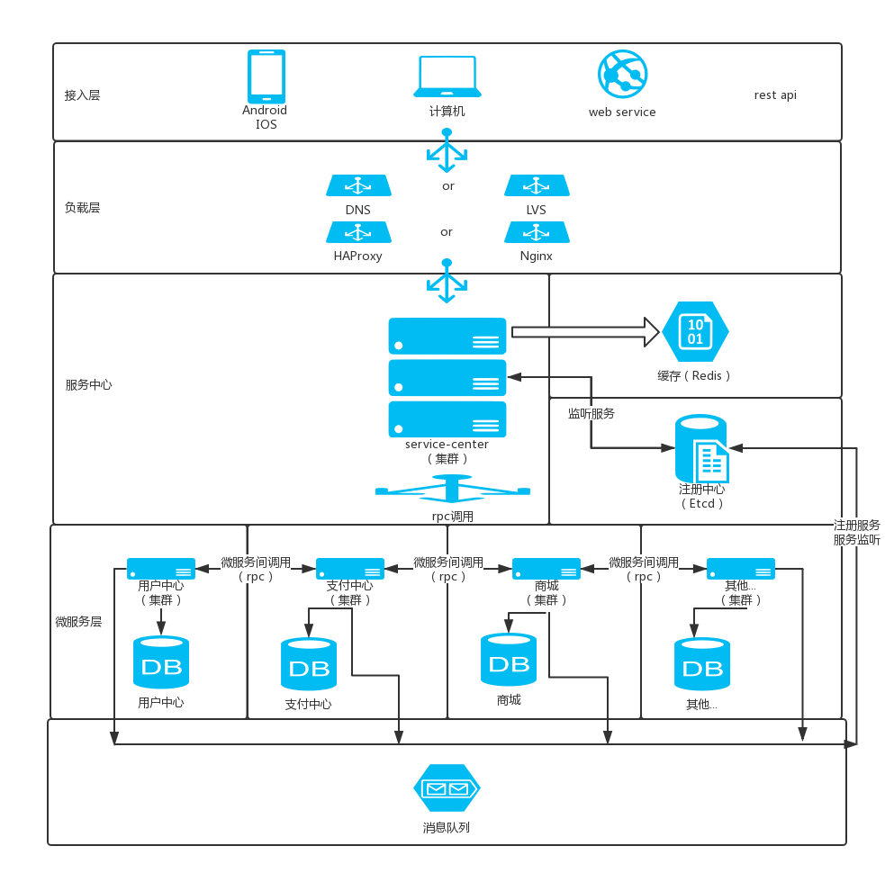

# 简介
service-center，也称服务中心，是分布式微服务项目的核心部分。
作为api网关，对外提供restful服务，对内通过rpc调用微服务节点。
具有服务鉴权（认证、授权）、负载均衡、服务路由、流量统计、日志记录（请求跟踪）等功能。

# 技术选型
- 语言:Go
- 注册中心:etcd
- cache:Redis
-  database:MySQL
- 架构特点:分布式、集群、微服务、高并发、高可用

# 架构

